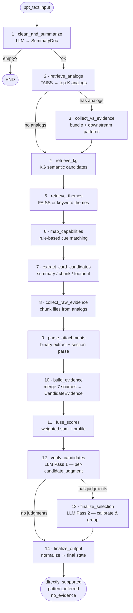
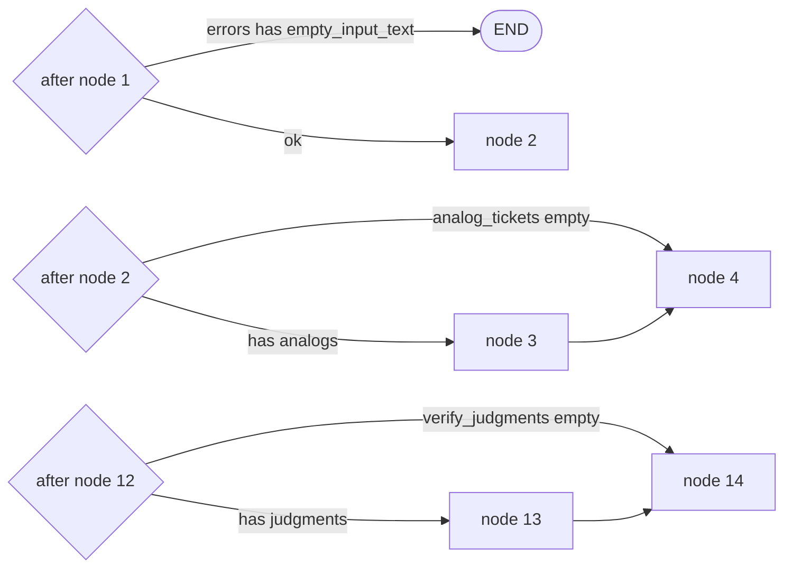
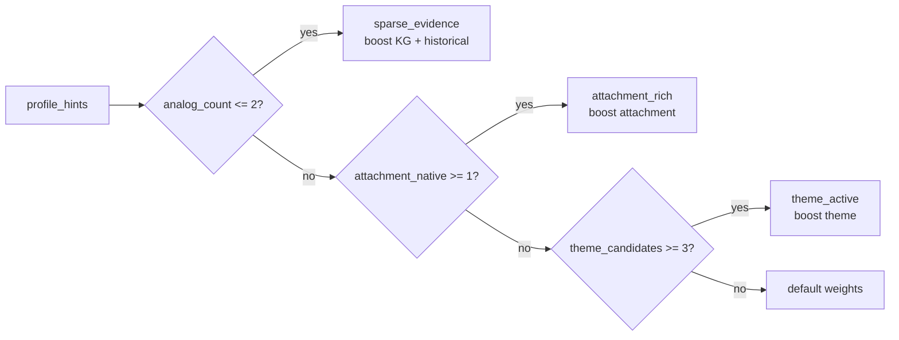
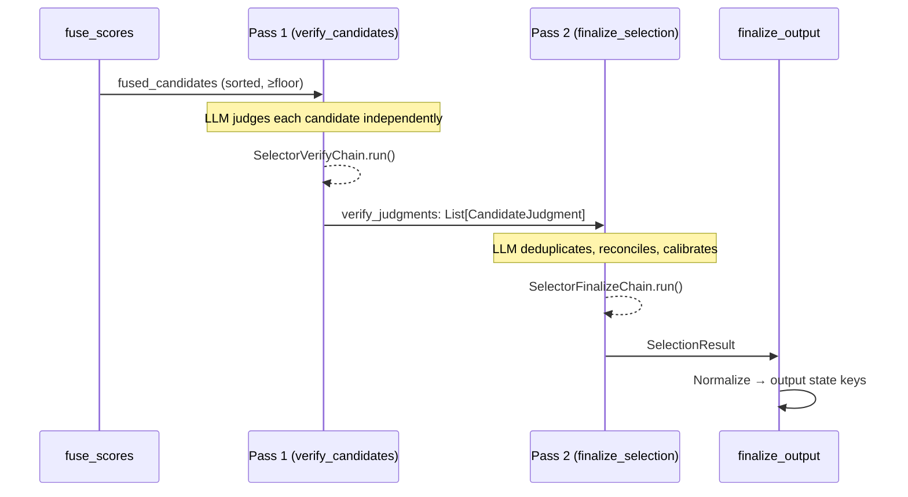
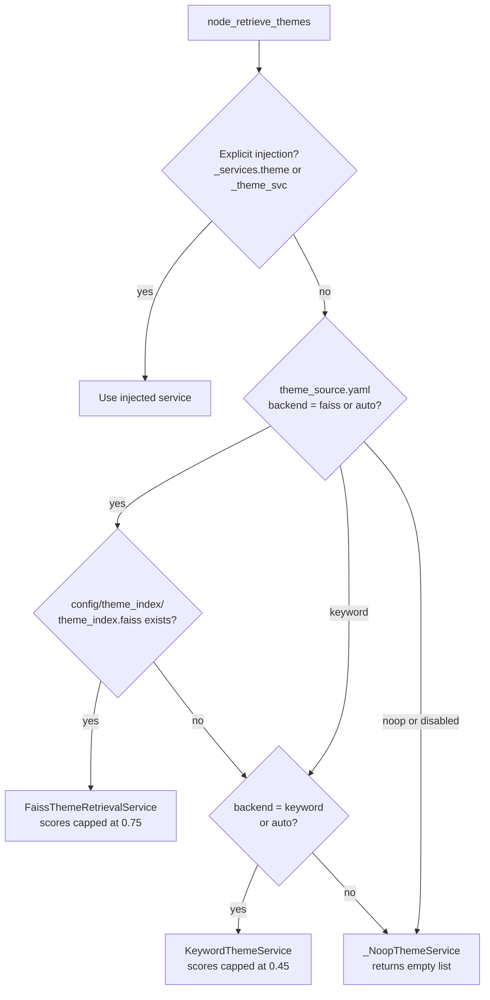
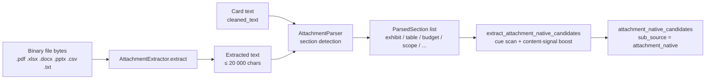
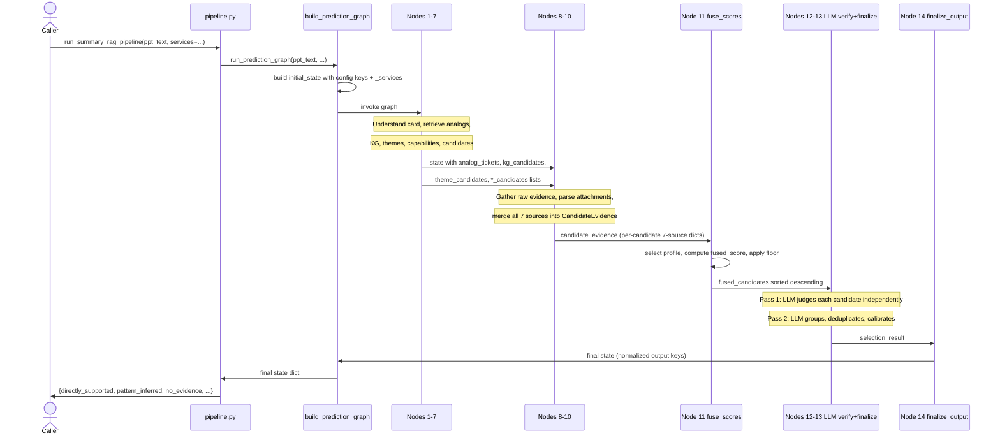

# rag-summary Architecture

> **V6 — graph-based evidence pipeline.**  
> Takes a raw business idea card and predicts which healthcare **value streams** it
> belongs to using a 14-node LangGraph workflow, 7 evidence sources, weighted fusion
> scoring, and two-pass LLM verification.

## Table of Contents

1. [System at a Glance](#system-at-a-glance)
2. [Pipeline Overview — 14 Nodes](#pipeline-overview--14-nodes)
3. [Node-by-Node Reference](#node-by-node-reference)
4. [State Model (PredictionState)](#state-model-predictionstate)
5. [7 Evidence Sources](#7-evidence-sources)
6. [Fusion Scoring](#fusion-scoring)
7. [Two-Pass LLM Verification](#two-pass-llm-verification)
8. [Service Container & Adapter Layer](#service-container--adapter-layer)
9. [Theme Service Cascade](#theme-service-cascade)
10. [Attachment Pipeline](#attachment-pipeline)
11. [Historical Footprint Patterns](#historical-footprint-patterns)
12. [Data Models](#data-models)
13. [Configuration Files](#configuration-files)
14. [Offline Tooling](#offline-tooling)
15. [Testing & Dependency Injection](#testing--dependency-injection)
16. [End-to-End Data Flow](#end-to-end-data-flow)

---

## System at a Glance



### Public entry point

```
pipeline.run_summary_rag_pipeline(ppt_text, *, allowed_value_stream_names=None,
    index_dir=..., ticket_chunks_dir=..., top_analogs=5, top_kg_candidates=20,
    include_raw_evidence=True, max_raw_evidence_tickets=3, min_candidate_floor=8,
    debug_output_dir=None, llm=None, theme_svc=None, intake_date=None, services=None)
    -> Dict[str, Any]
```

`pipeline.py` is a thin wrapper — all orchestration lives in `graph/build_prediction_graph.py`.
When `debug_output_dir` is set, 20+ JSON diagnostic files are written (intermediate
candidates, fusion profile, attachment metadata, theme debug, etc.).

---

## Pipeline Overview — 14 Nodes

| # | Node | Input state keys | Output state keys | LLM? |
|---|------|-----------------|------------------|------|
| 1 | `clean_and_summarize` | `raw_text` | `cleaned_text`, `new_card_summary` | Yes |
| 2 | `retrieve_analogs` | `new_card_summary`, `top_k_analogs` | `analog_tickets` | No |
| 3 | `collect_vs_evidence` | `analog_tickets` | `historical_value_stream_support`, `bundle_patterns`, `downstream_chains` | No |
| 4 | `retrieve_kg` | `new_card_summary`, `cleaned_text` | `kg_candidates` | No |
| 5 | `retrieve_themes` | `new_card_summary`, `cleaned_text`, `_intake_date` | `theme_candidates`, `theme_source_status`, `theme_debug` | No |
| 6 | `map_capabilities` | `new_card_summary`, `cleaned_text`, `kg_candidates` | `capability_mapping`, `enriched_candidates` | No |
| 7 | `extract_card_candidates` | `new_card_summary`, `cleaned_text`, `analog_tickets` | `summary_candidates`, `chunk_candidates`, `card_attachment_candidates`, `historical_footprint_candidates` | No |
| 8 | `collect_raw_evidence` | `analog_tickets`, `new_card_summary` | `raw_evidence`, `attachment_candidates` | No |
| 9 | `parse_attachments` | `cleaned_text`, `_attachment_contents` | `attachment_docs`, `attachment_native_candidates`, `attachment_extraction_metadata` | No |
| 10 | `build_evidence` | all candidate lists, `bundle_patterns`, `downstream_chains` | `candidate_evidence` | No |
| 11 | `fuse_scores` | `candidate_evidence` + profile hints | `fused_candidates`, `fusion_profile` | No |
| 12 | `verify_candidates` | `fused_candidates`, `new_card_summary`, `analog_tickets` | `verify_judgments` | Yes |
| 13 | `finalize_selection` | `verify_judgments`, `new_card_summary`, `fused_candidates` | `selection_result` | Yes |
| 14 | `finalize_output` | `selection_result` | `directly_supported`, `pattern_inferred`, `no_evidence`, `selected_value_streams`, `rejected_candidates` | No |

### Conditional edges



---

## Node-by-Node Reference

### Node 1: `clean_and_summarize`
**File:** `graph/nodes.py` → `node_clean_and_summarize`  
**Chain:** `chains/summary_chain.SummaryChain` (prompt `idea_card_summary.v3.yaml`)

1. `clean_card_text(raw_text)` — strips boilerplate, normalises punctuation.
2. If result is empty → appends `"empty_input_text"` to `errors` and returns early (triggers END edge).
3. `SummaryChain.run_card(cleaned_text)` — calls LLM via provider-native structured output (`structured_generate`); falls back to text generation + JSON parse + `model_validate`.
4. `_enrich_with_canonical(summary)` — runs `function_normalizer.normalize_functions()` to map raw LLM-extracted phrases to the canonical function vocabulary in `config/function_vocab.yaml`.
5. Falls back to a deterministic stub summary if the LLM call fails entirely.

**Key output fields in `new_card_summary`:** `short_summary`, `business_goal`, `actors`, `change_types`, `domain_tags`, `capability_tags`, `operational_footprint`, `direct_functions_canonical`, `implied_functions_canonical`, `retrieval_text`.

### Node 2: `retrieve_analogs`
**File:** `graph/nodes.py` → `node_retrieve_analogs`  
**Service:** `SummaryIndexService` (FAISS via `FaissIndexAdapter`)

Embeds `new_card_summary["retrieval_text"]` and searches the pre-built FAISS summary index for the top-K (default 5) most similar historical tickets.  
Returns `analog_tickets`: list of SummaryDoc-shaped dicts, each with a `score` (similarity 0–1), `ticket_id`, `value_stream_labels`, `capability_tags`, `canonical_functions`, etc.  
Handles a missing FAISS index gracefully (returns empty list; downstream nodes handle the no-analog case).

### Node 3: `collect_vs_evidence`
**File:** `graph/nodes.py` → `node_collect_vs_evidence`  
**Helpers:** `retrieval.history_patterns.detect_bundle_patterns`, `detect_downstream_chains`

Aggregates `value_stream_labels` across all analog tickets into `historical_value_stream_support` (per-VS support counts + best scores + supporting ticket IDs).

Detects **bundle patterns**: VS pairs that co-occur in ≥60% of analogs.  
`bundle_patterns` list items: `{primary_vs, bundled_vs, co_occurrence_count, co_occurrence_fraction, supporting_analog_ids}`.

Detects **downstream chains**: consistent sequential VS activation sequences.  
`downstream_chains` list items: `{upstream_vs, downstream_vs, analog_count, avg_downstream_score, supporting_analog_ids}`.

Both lists are later consumed by `build_evidence` to inject evidence snippets and boost `source_scores["historical"]`.

### Node 4: `retrieve_kg`
**File:** `graph/nodes.py` → `node_retrieve_kg`  
**Service:** `KGRetrievalService`

Builds a query string from `new_card_summary` fields and calls `retrieve_kg_candidates(query, top_k)`.  
Raw KG scores > 1 are normalised: `min(1.0, raw / (raw + 10.0))`.  
Returns `kg_candidates`: list of `{entity_name, score, ...}` dicts.

### Node 5: `retrieve_themes`
**File:** `graph/nodes.py` → `node_retrieve_themes`  
**Services:** `FaissThemeRetrievalService` (if index present) or `KeywordThemeService` (fallback)

Auto-discovery order:
1. Explicit injection via `_services.theme` or `_theme_svc` state key.
2. Check `config/theme_index/theme_index.faiss` — if exists, load `FaissThemeRetrievalService`.
3. Fall back to `KeywordThemeService` (always active, no setup required).
4. Config override via `config/theme_source.yaml` (`backend: auto|faiss|keyword|noop`).

Calls `theme_svc.retrieve_theme_candidates(query_text, top_k=10, allowed_names=...)`.  
Writes `theme_source_status` (backend name, active flag, max_score) and `theme_debug` (candidate details) to state for diagnostics.  
FAISS scores capped at 0.75; keyword scores capped at 0.45 (deliberately below FAISS to prevent over-inflation).

### Node 6: `map_capabilities`
**File:** `graph/nodes.py` → `node_map_capabilities`  
**Module:** `generation.capability_mapper.map_capabilities_to_candidates`

Loads `config/capability_map.yaml` (~30 clusters). For each cluster:
- Counts matched `direct_cues` and `indirect_cues` in `new_card_summary` + `cleaned_text`.
- Matches `canonical_functions` from `direct_functions_canonical` + `implied_functions_canonical`.
- Computes `signal_strength = (direct_hits + 0.5*indirect_hits) / normaliser`.
- If `signal_strength >= cluster.min_signal_strength` → promotes VS entries.

Applies score boosts: promoted VS +0.30 base, related VS +0.15.  
Outputs `capability_mapping` (per-cluster hit details) and `enriched_candidates` (KG candidates with capability score added).

### Node 7: `extract_card_candidates`
**File:** `graph/nodes.py` → `node_extract_card_candidates`  
**Module:** `generation.card_candidates`

Runs four parallel candidate extractors:

| Extractor | Source | Method | sub_source |
|-----------|--------|---------|------------|
| `extract_summary_candidates` | `capability_tags` + `canonical_functions` | tag/function → cluster → promote VS | `summary` |
| `extract_chunk_candidates` | `cleaned_text` raw cue scan | cue density → score 0.30–0.65 | `chunk` |
| `extract_card_attachment_candidates` | structural markers in text (Exhibit, Table, etc.) | heuristic section scoring | `attachment_heuristic` |
| `extract_historical_footprint_candidates` | analog `capability_tags` | footprint overlap | `historical` |

### Node 8: `collect_raw_evidence`
**File:** `graph/nodes.py` → `node_collect_raw_evidence`  
**Service:** `RawEvidenceService` (filesystem via `TicketChunksAdapter`)

If `_include_raw_evidence=False` → skips entirely.  
Otherwise reads chunk JSON files from `ticket_chunks/<ticket_id>/` (or `.json`) for the top `_max_raw_evidence_tickets` analogs.  
Ranks chunks by token overlap with query text; returns ≤3 snippets per ticket (max 300 chars each).  
Also produces `attachment_candidates` — proxy signals from attachment metadata in analog tickets.

### Node 9: `parse_attachments`
**File:** `graph/nodes.py` → `node_parse_attachments`  
**Classes:** `ingestion.attachment_extractor.AttachmentExtractor`, `ingestion.attachment_parser.AttachmentParser`  
**Function:** `generation.attachment_candidates.extract_attachment_native_candidates`

**Step A — Binary extraction** (only when `_attachment_contents` present in state):  
`AttachmentExtractor.extract(filename, bytes)` handles PDF/XLSX/DOCX/PPTX/CSV/TXT with graceful library fallback (see [Attachment Pipeline](#attachment-pipeline)).

**Step B — Section parsing** (on card text + any extracted text):  
`AttachmentParser.parse_card_text(cleaned_text)` detects structural section markers:  
`exhibit`, `appendix`, `table`, `budget`, `scope`, `roadmap`, `requirements`, `heading`, `body`.

**Step C — Native candidate extraction:**  
`extract_attachment_native_candidates(attachment_docs, allowed_names)` runs capability-map cue scan + content-signal boost per section → candidates with `sub_source="attachment_native"`.

Writes `attachment_docs` (ParsedAttachment dicts), `attachment_native_candidates`, and `attachment_extraction_metadata` to state.

### Node 10: `build_evidence`
**File:** `graph/nodes.py` → `node_build_evidence`  
**Function:** `generation.candidate_evidence.build_candidate_evidence`

Consolidates every candidate source list into one `CandidateEvidence` per unique value stream:

1. Creates `evidence_map` keyed by normalised candidate name.
2. Merges `source_scores` across all 7 sources (takes max on collision).
3. Appends `EvidenceSnippet` objects for each source match.
4. Calls `_inject_footprint_patterns(state)`:
   - Bundle patterns → adds `bundle_pattern` snippet + boosts `source_scores["historical"]` by `0.12 × co_occurrence_fraction` (max +0.084).
   - Downstream chains → adds `downstream_chain` snippet + boosts `source_scores["historical"]` by flat +0.08.
5. Computes `source_diversity_count` (number of active sources).
6. Classifies `support_type`:  
   - `direct`: chunk, summary, or KG source present + `attachment_native`.  
   - `pattern`: historical, capability, theme, `attachment_proxy/heuristic`.  
   - `mixed`: both direct and pattern sources.  
   - `none`: no active sources.

Output: `candidate_evidence` — list of `CandidateEvidence` dicts.

### Node 11: `fuse_scores`
**File:** `graph/nodes.py` → `node_fuse_scores`  
**Module:** `generation.fusion.compute_fused_scores`

See [Fusion Scoring](#fusion-scoring) for full detail.

Passes `profile_hints = {analog_count, attachment_native_count, theme_candidate_count}` to allow profile selection.  
Applies `apply_candidate_floor(candidates, min_candidate_floor)` to ensure the verifier sees at least N candidates.  
Returns candidates sorted descending by `fused_score` plus per-candidate `fusion_breakdown` and `fusion_profile` diagnostic fields.

### Node 12: `verify_candidates`
**File:** `graph/nodes.py` → `node_verify_candidates`  
**Chain:** `chains.selector_verify_chain.SelectorVerifyChain` (prompt `verify_candidates.v3.yaml`)

**Pass 1 verifier.** For each candidate the LLM independently decides:
- `directly_supported` — strong, direct evidence
- `pattern_inferred` — historical / pattern-based inference
- `no_evidence` — insufficient evidence

Context provided to the LLM: new card summary, top-5 analog summaries with VS labels, top-20 fused candidates with source breakdowns, top-10 raw evidence snippets.

Primary path: `structured_generate()` → `VerificationResult`.  
Fallback: text generation → JSON parse → `model_validate()`.  
Returns flat `verify_judgments: List[CandidateJudgment]` (not yet grouped).

### Node 13: `finalize_selection`
**File:** `graph/nodes.py` → `node_finalize_selection`  
**Chain:** `chains.selector_finalize_chain.SelectorFinalizeChain` (prompt `finalize_selection.v3.yaml`)

**Pass 2 selector.** Receives Pass 1 flat judgments + fused scores. Responsibilities:
- Deduplication (multiple judgment instances for same VS).
- Contradiction cleanup.
- Fused-score reconciliation (judgments vs numeric scores).
- Demotion of weak or borderline predictions.

Returns `SelectionResult` with `directly_supported[]`, `pattern_inferred[]`, `no_evidence[]`.  
Fallback (if LLM fails): `_judgments_to_selection_result()` converts directly, assigning default confidence 0.70 (direct) / 0.50 (pattern).  
**Skipped entirely** if `verify_judgments` is empty (conditional edge).

### Node 14: `finalize_output`
**File:** `graph/nodes.py` → `node_finalize_output`

Deserialises `SelectionResult` into final state keys.  
Computes `selected_value_streams` = union of `directly_supported` + `pattern_inferred`.  
Populates `rejected_candidates` from `no_evidence`.  
Applies `allowed_value_stream_names` allow-list filter if provided.  
Handles both Pydantic objects and plain dicts (backward compat).

---

## State Model (PredictionState)

`models/graph_state.py` — `TypedDict` with `total=False` (all fields optional).

| Stage | State key | Type | Set by |
|-------|-----------|------|--------|
| Input | `raw_text` | `str` | caller |
| Input | `allowed_value_stream_names` | `List[str]` | caller |
| Input | `top_k_analogs` | `int` | caller |
| Node 1 | `cleaned_text` | `str` | clean_and_summarize |
| Node 1 | `new_card_summary` | `Dict` (SummaryDoc-shaped) | clean_and_summarize |
| Node 2 | `analog_tickets` | `List[Dict]` | retrieve_analogs |
| Node 3 | `historical_value_stream_support` | `List[Dict]` | collect_vs_evidence |
| Node 3 | `bundle_patterns` | `List[Dict]` | collect_vs_evidence |
| Node 3 | `downstream_chains` | `List[Dict]` | collect_vs_evidence |
| Node 4 | `kg_candidates` | `List[Dict]` | retrieve_kg |
| Node 5 | `theme_candidates` | `List[Dict]` | retrieve_themes |
| Node 5 | `theme_source_status` | `Dict` | retrieve_themes |
| Node 5 | `theme_debug` | `Dict` | retrieve_themes |
| Node 6 | `capability_mapping` | `Dict` | map_capabilities |
| Node 6 | `enriched_candidates` | `List[Dict]` | map_capabilities |
| Node 7 | `summary_candidates` | `List[Dict]` | extract_card_candidates |
| Node 7 | `chunk_candidates` | `List[Dict]` | extract_card_candidates |
| Node 7 | `card_attachment_candidates` | `List[Dict]` | extract_card_candidates |
| Node 7 | `historical_footprint_candidates` | `List[Dict]` | extract_card_candidates |
| Node 8 | `raw_evidence` | `List[Dict]` | collect_raw_evidence |
| Node 8 | `attachment_candidates` | `List[Dict]` (proxy) | collect_raw_evidence |
| Node 9 | `attachment_docs` | `List[Dict]` (ParsedAttachment) | parse_attachments |
| Node 9 | `attachment_native_candidates` | `List[Dict]` | parse_attachments |
| Node 9 | `attachment_extraction_metadata` | `List[Dict]` | parse_attachments |
| Node 10 | `candidate_evidence` | `List[Dict]` (CandidateEvidence) | build_evidence |
| Node 11 | `fused_candidates` | `List[Dict]` | fuse_scores |
| Node 11 | `fusion_profile` | `str` | fuse_scores |
| Node 12 | `verify_judgments` | `List[Dict]` (CandidateJudgment) | verify_candidates |
| Node 13 | `selection_result` | `Dict` (SelectionResult) | finalize_selection |
| Node 14 | `directly_supported` | `List[Dict]` | finalize_output |
| Node 14 | `pattern_inferred` | `List[Dict]` | finalize_output |
| Node 14 | `no_evidence` | `List[Dict]` | finalize_output |
| Node 14 | `selected_value_streams` | `List[Dict]` | finalize_output |
| Node 14 | `rejected_candidates` | `List[Dict]` | finalize_output |
| Diag | `errors` | `List[str]` | any node |
| Diag | `warnings` | `List[str]` | any node |
| Diag | `timing` | `Dict[str, float]` | pipeline.py |

### Private config keys (injected by `run_prediction_graph`, underscore-prefixed)

| Key | Default | Description |
|-----|---------|-------------|
| `_index_dir` | `"faiss_index"` | FAISS summary index directory |
| `_ticket_chunks_dir` | `"ticket_chunks"` | Raw chunk file directory |
| `_top_kg_candidates` | `20` | Max KG candidates |
| `_include_raw_evidence` | `True` | Whether to load chunk files |
| `_max_raw_evidence_tickets` | `3` | Max analog tickets to load chunks from |
| `_min_candidate_floor` | `8` | Min candidates passed to verifier |
| `_llm` | `None` (factory) | LLMService instance |
| `_theme_svc` | `None` (auto-discover) | ThemeRetrievalService instance |
| `_intake_date` | `None` | ISO date string for temporal cutoff |
| `_services` | `None` | ServiceContainer (preferred injection point) |

---

## 7 Evidence Sources

Every candidate receives a `source_scores` dict with entries for all 7 sources.
Missing sources default to 0.0.

| Source | Base Weight | Produced by (node) | sub_source tags | Quality multiplier |
|--------|-------------|-------------------|-----------------|-------------------|
| `chunk` | 0.20 | collect_raw_evidence (8) | — | 1.00 |
| `summary` | 0.15 | extract_card_candidates (7) | — | 1.00 |
| `attachment` | 0.18 | parse_attachments (9), collect_raw_evidence (8) | `attachment_native` (1.00), `attachment_proxy` (0.75), `attachment_heuristic` (0.55) | varies |
| `theme` | 0.08 | retrieve_themes (5) | `keyword_theme` (capped 0.45), FAISS theme (capped 0.75) | 1.00 |
| `kg` | 0.18 | retrieve_kg (4) | — | 1.00 |
| `historical` | 0.12 | collect_vs_evidence (3), build_evidence footprint injection (10) | `bundle_pattern`, `downstream_chain` | 1.00 |
| `capability` | 0.09 | map_capabilities (6), extract_card_candidates (7) | — | 1.00 |

### sub_source taxonomy

```
attachment_native     — directly parsed from binary attachment section content
attachment_proxy      — inferred from analog ticket attachment metadata
attachment_heuristic  — structural marker detection in raw card text
bundle_pattern        — VS pair co-occurrence pattern across analogs
downstream_chain      — sequential VS activation pattern in analogs
keyword_theme         — capability-map keyword match (KeywordThemeService)
```

---

## Fusion Scoring

**File:** `generation/fusion.py` — `compute_fused_scores(candidates, weights=None, profile_hints=None)`

### Formula

```
S_adj(source) = S_raw(source) * quality_multiplier(sub_source)

S_fused(v) = sum( weight[source] * S_adj(source, v) )
           + diversity_bonus           # 0.03 per active source beyond 1st, max 0.15
           + theme_promotion_bonus      # +0.04 flat if theme_score >= 0.50
           - no_evidence_penalty        # -0.10 if zero active sources
```

### Profile selection

Profiles are evaluated in priority order; the first whose trigger fires overrides the base weights.

| Profile | Priority | Trigger | Key weight changes |
|---------|----------|---------|-------------------|
| `sparse_evidence` | 1 | `analog_count <= 2` | kg↑ 0.24, chunk↓ 0.15, historical↑ 0.14 |
| `attachment_rich` | 2 | `attachment_native_count >= 1` | attachment↑ 0.26, summary↓ 0.12 |
| `theme_active` | 3 | `theme_candidate_count >= 3` | theme↑ 0.14, chunk↓ 0.18 |
| `default` | — | (none fired) | chunk 0.20, summary 0.15, attachment 0.18, theme 0.08, kg 0.18, historical 0.12, capability 0.09 |



### Quality multipliers (attachment sub_source)

```
attachment_native    × 1.00   (full signal — parsed section content)
attachment_proxy     × 0.75   (moderate — inferred from analog metadata)
attachment_heuristic × 0.55   (weakest — structural marker only)
```

### Candidate floor

`apply_candidate_floor(candidates, min_candidate_floor)` ensures at least `min_candidate_floor` (default 8)
candidates are passed to the verifier, preventing the LLM from receiving an empty or near-empty list.

---

## Two-Pass LLM Verification



### Pass 1 — `SelectorVerifyChain`

**Prompt:** `prompts/selector/verify_candidates.v3.yaml`  
**Output:** `VerificationResult` containing `List[CandidateJudgment]`

Each `CandidateJudgment`:
```python
entity_name: str
bucket:      Literal['directly_supported', 'pattern_inferred', 'no_evidence']
confidence:  float   # 0-1
rationale:   str
```

LLM context provided:
- New card summary (short_summary, business_goal, actors, canonical functions, capability_tags)
- Top 5 analog summaries with VS labels and canonical functions
- Top 20 fused candidates with per-source score breakdown
- Top 10 raw evidence snippets from analog chunks

**Primary path:** `structured_generate()` → `model_validate(VerificationResult)`  
**Fallback:** text generation → JSON extract → `model_validate()`

### Pass 2 — `SelectorFinalizeChain`

**Prompt:** `prompts/selector/finalize_selection.v3.yaml`  
**Output:** `SelectionResult`

Responsibilities:
- Deduplicate (same VS appearing multiple times in Pass 1 output)
- Resolve contradictions (e.g., same VS in both directly_supported and no_evidence)
- Reconcile fused numeric scores with LLM judgments
- Demote weak borderline predictions to `no_evidence`

**Fallback:** `_judgments_to_selection_result(judgments)` — converts Pass 1 output directly,
assigning default confidence 0.70 for directly_supported, 0.50 for pattern_inferred.

### Prompt version hierarchy

| Version | Strategy | When used |
|---------|----------|-----------|
| v3 | Schema-light; relies on provider-native structured output | Default |
| v2 | JSON schema embedded in prompt body | Provider doesn't support structured output |
| v1 | Legacy full JSON skeleton | Last resort / old clients |

---

## Service Container & Adapter Layer

**File:** `graph/service_container.py`

```python
@dataclass
class ServiceContainer:
    llm:           Optional[LLMService]           = None
    embedding:     Optional[EmbeddingService]      = None
    kg:            Optional[KGRetrievalService]    = None
    theme:         Optional[ThemeRetrievalService] = None
    summary_index: Optional[SummaryIndexService]   = None
    raw_evidence:  Optional[RawEvidenceService]    = None
    index_dir:            str = 'faiss_index'
    ticket_chunks_dir:    str = 'ticket_chunks'
    intake_date: Optional[str] = None
```

### `_get_services(state)` resolution order

```mermaid
flowchart TD
    S[state] --> C{_services key\npresent?}
    C -->|yes| SC[Use ServiceContainer fields]
    C -->|no| IK{Individual _llm,\n_theme_svc keys?}
    IK -->|yes| IND[Use individual state keys]
    IK -->|no| FAC[get_default_llm()\nget_default_theme()\nget_default_kg()\netc.]
    SC --> OUT[resolved services dict]
    IND --> OUT
    FAC --> OUT
```

### Protocol interfaces (`ingestion/adapters.py`)

All interfaces are `@runtime_checkable` Protocols — duck-typing, no inheritance required.

| Protocol | Key method | Used by |
|----------|-----------|---------|
| `LLMService` | `generate(query, *, context, system_prompt) -> LLMResponse` | Chains (summary, verify, finalize) |
| `StructuredLLMService` | `generate_structured(query, output_schema, ...) -> Pydantic` | All chains (preferred) |
| `EmbeddingService` | `embed_documents(texts)`, `embed_query(text)` | FAISS indexer, theme indexer |
| `KGRetrievalService` | `retrieve_candidates(query_text, *, top_k, allowed_names)` | node 4 |
| `ThemeRetrievalService` | `retrieve_theme_candidates(query_text, *, top_k, allowed_names)` | node 5 |
| `SummaryIndexService` | `search(query_text, *, top_k, allowed_vs_names)` | node 2 |
| `RawEvidenceService` | `get_chunks_for_ticket(ticket_id, *, query_text, top_k)` | node 8 |

### Concrete implementations (`ingestion/adapters_impl.py`)

| Class | Wraps | Notes |
|-------|-------|-------|
| `FaissIndexAdapter` | `FaissIndexer` | Embeds query, searches FAISS summary index; returns analog dicts with scores |
| `TicketChunksAdapter` | Filesystem reader | Reads `ticket_chunks/<id>.json` or `ticket_chunks/<id>/*.json`; returns chunks sorted by score |

### Default factories (`ingestion/adapters.py`)

| Factory | Resolution |
|---------|-----------|
| `get_default_llm()` | Lazy import `src.services.generation_service.GenerationService` |
| `get_default_embedding()` | Lazy import `src.clients.embedding.EmbeddingClient` |
| `get_default_kg()` | `_KGRetrievalAdapter` wrapping internal KG pipeline |
| `get_default_theme()` | Config cascade: FAISS → keyword → noop (see Theme Service Cascade) |

---

## Theme Service Cascade



### FAISS theme scoring

**File:** `ingestion/theme_retrieval_service.py` — `FaissThemeRetrievalService`

```
raw_sim      = FAISS cosine similarity (0–1)
vs_fraction  = theme_doc.vs_support_fractions[vs_name]   # fraction of theme members with this VS
quality      = min(1.0, 0.5 + 0.5 * theme_doc.cohesion_score)
candidate_score = min(0.75, raw_sim * vs_fraction * quality)
```

A `ThemeDoc` represents a cluster of similar historical tickets:
```python
theme_id:              str
theme_label:           str
member_ticket_ids:     List[str]
capability_tags:       List[str]
vs_support_fractions:  Dict[str, float]   # VS → fraction of members
cohesion_score:        float              # internal cluster coherence
cue_phrases:           List[str]
```

### Keyword theme scoring

**File:** `ingestion/keyword_theme_service.py` — `KeywordThemeService`

Zero-setup fallback. Requires only `config/capability_map.yaml`.

```
CUE_NORM   = 5.0
BASE_SCALE = 0.45
cue_score  = weighted_match_count / CUE_NORM
score      = min(BASE_SCALE, cue_score * cluster.weight * BASE_SCALE)
```

Scores are deliberately capped below 0.50 so keyword-derived candidates always sit in
`pattern_inferred` territory — they cannot push a candidate into `directly_supported` alone.

---

## Attachment Pipeline



### Binary extraction quality hierarchy

**File:** `ingestion/attachment_extractor.py` — `AttachmentExtractor`

| Format | Primary library | Fallback | extraction_quality |
|--------|----------------|----------|--------------------|
| PDF | pdfplumber | PyPDF2 | high / medium |
| XLSX | openpyxl | stub text | medium / low |
| XLS | xlrd | stub text | medium / low |
| DOCX | python-docx | stub text | medium / low |
| PPTX | python-pptx | stub text | medium / low |
| CSV | stdlib csv | direct read | high |
| TXT | direct read | — | high |
| unknown | — | — | failed |

Max extraction: **20,000 characters** per file (`_MAX_CHARS = 20_000`).
Missing libraries are caught gracefully — partial text + warning, never a hard crash.

### Section type detection (`AttachmentParser`)

| Section type | Detection pattern | Score ceiling |
|-------------|------------------|--------------|
| `budget` | `budget[:\-–—]?` | 0.72 |
| `scope` | `scope(\s+of\s+work)?[:\-–—]` | 0.70 |
| `requirements` | `requirements?[:\-–—]` | 0.68 |
| `exhibit` | `exhibit\s+[a-z0-9]+` | 0.65 |
| `appendix` | `appendix\s+[a-z0-9]+` | 0.62 |
| `table` | `table\s+[0-9]+` | 0.60 |
| `roadmap` | `roadmap[:\-–—]?` | 0.60 |
| `heading` | All-caps line 4-60 chars | 0.55 |
| `body` | (default) | 0.50 |

### Content-signal boost (section-type-aware)

Applied **once per section** before the cluster loop; added on top of cue-scan score.

| Section type | Signal | Boost amount |
|-------------|--------|-------------|
| `budget` | Financial terms (`$`, `million`, `cost`, `premium`, `roi`) | +0.02–0.08 |
| `scope` / `requirements` | Action verbs (`implement`, `integrate`, `deploy`, …) ≥ 2 unique | +0.015–0.07 |
| `table` | ≥ 2 domain keywords (`claim`, `billing`, `member`, `eligibility`, …) | +0.05 |

---

## Historical Footprint Patterns

**File:** `retrieval/history_patterns.py` — pure functions, no I/O, no LLM.

### Bundle pattern detection

```python
detect_bundle_patterns(
    analog_tickets,
    min_co_occurrence_fraction=0.60,   # VS pair must co-occur in ≥60% of analogs
    min_analog_count=2,                 # minimum analog corpus size
    allowed_names=None
)
```

**Algorithm:**
1. For every pair of VS names (A, B) appearing in any analog's `value_stream_labels`:
2. Count how many analogs contain *both* A and B.
3. If `count / total_analogs >= min_co_occurrence_fraction` → emit bundle pattern.
4. Emitted in both directions (A→B and B→A).

**Bundle dict:**
```python
{
  'primary_vs':           str,
  'bundled_vs':           str,
  'co_occurrence_count':  int,
  'co_occurrence_fraction': float,   # e.g. 0.80
  'supporting_analog_ids': List[str]
}
```

**Evidence injection (node 10):**  
Adds `EvidenceSnippet(source='historical', sub_source='bundle_pattern')` and boosts:
```
source_scores['historical'] += 0.12 * co_occurrence_fraction   # max +0.084 at fraction=0.70
```

### Downstream chain detection

```python
detect_downstream_chains(vs_support)   # vs_support from collect_value_stream_evidence()
```

**Algorithm:**
1. Identifies VS pairs where one consistently appears as a downstream activation in analogs.
2. Pairs downstream VS with the best-overlapping direct VS (shared in ≥2 analogs).
3. Downstream score = 0.80 × best analog VS score.

**Chain dict:**
```python
{
  'upstream_vs':           str,
  'downstream_vs':         str,
  'analog_count':          int,
  'avg_downstream_score':  float,
  'supporting_analog_ids': List[str]
}
```

**Evidence injection (node 10):**  
Adds `EvidenceSnippet(source='historical', sub_source='downstream_chain')` and boosts:
```
source_scores['historical'] += 0.08   # flat boost
```

### Capability overlap scoring

```python
compute_capability_overlap(new_card_summary, analog)
# Returns float 0-1

# Blended Jaccard:
tag_jaccard  = |tags_new ∩ tags_analog| / |tags_new ∪ tags_analog|
func_jaccard = |funcs_new ∩ funcs_analog| / |funcs_new ∪ funcs_analog|
score = 0.70 * tag_jaccard + 0.30 * func_jaccard
```

Stored as `capability_overlap_score` on `CandidateEvidence` for diagnostic use.

---

## Data Models

All core models are Pydantic — validated on deserialisation, serialisable via `.model_dump()`.

### `SummaryDoc` (`models/summary_doc.py`)

The canonical data contract for both historical tickets and new cards.

| Field | Type | Description |
|-------|------|-------------|
| `doc_id` | str | Unique document ID |
| `ticket_id` | str | Source ticket / card identifier |
| `title` | str | Card or ticket title |
| `short_summary` | str | 1-2 sentence summary |
| `business_goal` | str | Core business objective |
| `actors` | List[str] | People/systems involved |
| `change_types` | List[str] | Type of change (new feature, config, etc.) |
| `domain_tags` | List[str] | Domain keywords |
| `evidence_sentences` | List[str] | Key sentences supporting summary |
| `direct_functions_raw` | List[str] | Raw LLM-extracted direct functions |
| `implied_functions_raw` | List[str] | Raw LLM-extracted implied functions |
| `direct_functions_canonical` | List[str] | Normalised to `config/function_vocab.yaml` |
| `implied_functions_canonical` | List[str] | Normalised to vocab |
| `direct_functions` | List[str] | Legacy alias (= canonical) |
| `implied_functions` | List[str] | Legacy alias (= canonical) |
| `capability_tags` | List[str] | Capability cluster tags |
| `operational_footprint` | List[str] | Operational domain tags |
| `value_stream_labels` | List[str] | Ground-truth VS (historical only) |
| `value_stream_ids` | List[str] | Ground-truth VS IDs |
| `stream_support_type` | Dict[str,str] | VS → support type mapping |
| `supporting_evidence` | List[str] | Evidence snippets (historical only) |
| `co_occurrence_bundle` | List[str] | Co-occurring VS bundle (historical only) |
| `retrieval_text` | str | Pre-packed text used for FAISS embedding |

### `CandidateEvidence` (`models/candidate_evidence.py`)

Per-candidate runtime artifact holding all evidence across 7 sources.

| Field | Type | Description |
|-------|------|-------------|
| `candidate_id` | str | Unique ID |
| `candidate_name` | str | Value stream name |
| `description` | str | VS description |
| `source_scores` | Dict[str,float] | Score per source (all 7) |
| `evidence_sources` | List[str] | Active sources only |
| `evidence_snippets` | List[EvidenceSnippet] | All snippet evidence |
| `fused_score` | float | Final weighted fused score |
| `support_confidence` | float | Overall confidence |
| `source_diversity_count` | int | Number of active sources |
| `support_type` | str | `none`/`direct`/`pattern`/`mixed` |
| `contradictions` | List[str] | Conflicting signals (if any) |
| `capability_overlap_score` | float | Jaccard vs best analog |
| `bundle_pattern_count` | int | Number of bundle patterns matched |
| `downstream_chain_count` | int | Number of downstream chains matched |
| `theme_match_count` | int | Number of theme candidates |
| `fusion_breakdown` | Dict | Per-source weighted contribution (diagnostic) |
| `fusion_profile` | str | Profile used for this candidate |

### `EvidenceSnippet` (`models/candidate_evidence.py`)

| Field | Type | Description |
|-------|------|-------------|
| `source` | str | One of the 7 source names |
| `snippet` | str | Text excerpt |
| `score` | float | Evidence score 0–1 |
| `sub_source` | Optional[str] | Sub-type tag (see taxonomy above) |
| `attachment_id` | Optional[str] | Source attachment |
| `section_id` | Optional[str] | Source section within attachment |
| `section_title` | Optional[str] | Section heading text |
| `section_type` | Optional[str] | Detected section type |

### `CandidateJudgment` / `VerificationResult` (`models/candidate_judgment.py`)

```python
class CandidateJudgment(BaseModel):
    entity_name: str
    bucket:      Literal['directly_supported', 'pattern_inferred', 'no_evidence']
    confidence:  float
    rationale:   str

class VerificationResult(BaseModel):
    judgments: List[CandidateJudgment]
```

### `SelectionResult` / `SupportedStream` (`models/selection.py`)

```python
class SupportedStream(BaseModel):
    entity_name:          str
    entity_id:            str = ''
    confidence:           float
    evidence:             str = ''
    pattern_basis:        Optional[str]        # analog_similarity | bundle_pattern | downstream_chain | capability_overlap | theme
    supporting_analog_ids: Optional[List[str]]

class UnsupportedStream(BaseModel):
    entity_name: str
    reason:      str = ''

class SelectionResult(BaseModel):
    directly_supported: List[SupportedStream] = []
    pattern_inferred:   List[SupportedStream] = []
    no_evidence:        List[UnsupportedStream] = []
```

---

## Configuration Files

### `config/source_weights.yaml`

Controls all fusion scoring behaviour.

```yaml
version: "2"

# Base weights (sum ≈ 1.0)
weights:
  chunk:      0.20
  summary:    0.15
  attachment: 0.18
  theme:      0.08
  kg:         0.18
  historical: 0.12
  capability: 0.09

# Runtime profiles (trigger → weight override)
profiles:
  sparse_evidence:
    priority: 1
    trigger: { max_analog_count: 2 }
    weights: { chunk: 0.15, summary: 0.18, attachment: 0.14,
               theme: 0.06, kg: 0.24, historical: 0.14, capability: 0.09 }
  attachment_rich:
    priority: 2
    trigger: { min_attachment_native_count: 1 }
    weights: { chunk: 0.16, summary: 0.12, attachment: 0.26,
               theme: 0.07, kg: 0.16, historical: 0.12, capability: 0.11 }
  theme_active:
    priority: 3
    trigger: { min_theme_candidate_count: 3 }
    weights: { chunk: 0.18, summary: 0.14, attachment: 0.16,
               theme: 0.14, kg: 0.16, historical: 0.12, capability: 0.10 }

diversity_bonus: { per_source: 0.03, max_total: 0.15 }
penalties: { no_evidence: -0.10 }
theme_promotion: { min_score: 0.50, bonus: 0.04 }
quality_multipliers:
  attachment_native:    1.00
  attachment_proxy:     0.75
  attachment_heuristic: 0.55
```

### `config/capability_map.yaml`

~30 capability clusters. Each cluster maps cue phrases → canonical functions → promoted VS.

```yaml
capabilities:
  compliance_privacy_audit:
    description: Privacy, auditability, regulatory obligations
    direct_cues:   [privacy, pii, audit, controls, regulatory]
    indirect_cues: [governed data sharing, policy enforcement]
    canonical_functions: [compliance, request handling]
    promote_value_streams:  [Ensure Compliance]
    related_value_streams:  [Manage Enterprise Risk]
    weight: 1.0
    min_signal_strength: 0.6
  # ... ~29 more clusters
```

Key domains covered: billing, compliance, vendor onboarding, network management,
enrollment, claims, eligibility, provider relations, risk management, reporting.

### `config/theme_source.yaml`

```yaml
version: "1"
enabled: true
backend: auto          # auto | faiss | keyword | noop
theme_index_dir: config/theme_index
top_k: 10
min_score: 0.10
require_intake_date_cutoff: true   # prevents temporal leakage
min_vs_support_fraction: 0.30      # minimum fraction for VS inclusion
```

| `backend` value | Behaviour |
|----------------|-----------|
| `auto` | Try FAISS if index exists; fall back to keyword |
| `faiss` | Require FAISS index; error if missing |
| `keyword` | Always use `KeywordThemeService` |
| `noop` | Disable theme retrieval entirely |

### `config/function_vocab.yaml`

```yaml
version: "1"
vocab:
  - product setup
  - outreach
  - reporting
  - vendor integration
  - billing
  - payment
  # ... ~35 canonical function names

phrase_rules:
  - triggers: [product, setup]
    canonical: product setup
  - triggers: [product, launch]
    canonical: product setup
  # ... rule-based mapping from raw LLM output → canonical vocab
```

Used by `ingestion/function_normalizer.normalize_functions()` to standardise LLM-extracted
function phrases before they are stored in `direct_functions_canonical` /
`implied_functions_canonical`.

---

## Offline Tooling

All tools live in `tools/` and are run as `python -m rag_summary.tools.<name>`.
None of them execute during prediction — they build the static artefacts the pipeline reads.

### `build_theme_index.py`

Clusters historical ticket summaries into themes and writes a FAISS theme index.

```bash
python -m rag_summary.tools.build_theme_index \
  --summary-dir summaries/ \
  --output-dir  config/theme_index/ \
  --n-clusters  40 \
  --min-cohesion 0.35 \
  --cutoff-date  2024-01-01
```

**Output artefacts:**
```
config/theme_index/
  theme_index.faiss      — unit-normalised cosine FAISS index
  theme_docs.json        — List[ThemeDoc] metadata
  theme_manifest.json    — build metadata (model, date, cluster count)
```

Run this whenever the historical ticket corpus changes significantly.

### `build_capability_map.py`

Evidence-grounded capability map builder. Derives cues from real ticket data via TF-IDF,
not a hand-written template.

```bash
python -m rag_summary.tools.build_capability_map \
  --summary-dir   summaries/ \
  --output-path   config/capability_map.yaml \
  --min-ticket-count 3 \
  --top-cues      15 \
  --cutoff-date   2024-01-01
```

**Verification after rebuild:**
```bash
python -m rag_summary.tools.validate_capability_map
python -m rag_summary.tools.capability_map_regression_check \
  --old config/capability_map.yaml.bak \
  --new config/capability_map.yaml
```

### `build_vs_corpus.py`

Builds the KG value-stream corpus from historical tickets. Run before (re)indexing the KG.

### `validate_capability_map.py`

Checks the capability map for:
- Coverage % (VS names in map vs known VS list)
- Overlapping clusters (same cue in multiple clusters)
- Weak-cue detection (clusters with < 2 direct cues)
- VS-to-cluster ratio (clusters promoting ≥ 5 VS → likely too broad)

### `validate_capability_map.py` / `capability_map_regression_check.py`

Run after rebuilding to ensure coverage didn't regress.

### FAISS summary index

Built by `ingestion/faiss_indexer.build_summary_index()` (not a tool script — called by
your ingestion pipeline).

```
<index_dir>/
  index.faiss           — FAISS binary index (L2)
  index.pkl             — LangChain FAISS pickled metadata
  summary_docs.json     — original SummaryDoc dicts
  index_manifest.json   — schema_version, embedding_model, ticket_count
```

Score normalisation: FAISS returns L2 distance; pipeline converts via `1 / (1 + distance)`
so higher always means more similar.

---

## Testing & Dependency Injection

**File:** `tests/fakes.py`

Because every external service is a Protocol, tests inject deterministic fakes via
`ServiceContainer` without touching any `src.*` imports.

```python
from rag_summary.graph.service_container import ServiceContainer
from tests.fakes import FakeLLM, FakeSummaryIndex, FakeKG, FakeThemeService

container = ServiceContainer(
    llm=FakeLLM(responses={...}),
    summary_index=FakeSummaryIndex(analogs=[...]),
    kg=FakeKG(candidates=[...]),
    theme=FakeThemeService(candidates=[...]),
)

result = run_summary_rag_pipeline(ppt_text, services=container)
```

| Fake | What it simulates |
|------|------------------|
| `FakeLLM` | Returns fixed JSON responses per call index |
| `FakeSummaryIndex` | Returns a hardcoded analog list |
| `FakeKG` | Returns hardcoded KG candidates |
| `FakeThemeService` | Returns hardcoded theme candidates |
| `FakeRawEvidence` | Returns hardcoded chunk snippets |

### Unit testing individual nodes

Each node is a pure function — test by constructing a minimal state dict:

```python
from rag_summary.graph.nodes import node_retrieve_themes
from rag_summary.graph.service_container import ServiceContainer
from tests.fakes import FakeThemeService

state = {
    'new_card_summary': {'capability_tags': ['compliance'], 'retrieval_text': 'audit controls'},
    'cleaned_text': 'We need to improve audit controls.',
    '_services': ServiceContainer(theme=FakeThemeService([
        {'entity_name': 'Ensure Compliance', 'score': 0.62}
    ]))
}
out = node_retrieve_themes(state)
assert out['theme_source_status']['active'] is True
```

---

## End-to-End Data Flow



### Output structure

```python
{
  # Three-class prediction result
  'directly_supported':     List[SupportedStream],    # strong direct evidence
  'pattern_inferred':       List[SupportedStream],    # historical / pattern inference
  'no_evidence':            List[UnsupportedStream],  # rejected candidates

  # Convenience union of directly + pattern
  'selected_value_streams': List[SupportedStream],

  # Full evidence breakdown for explainability
  'candidate_value_streams': List[Dict],   # CandidateEvidence dicts with 7-source scores

  # Key intermediate artefacts
  'new_card_summary':    Dict,       # SummaryDoc for the input card
  'analog_tickets':      List[Dict], # top-K FAISS analog tickets with scores
  'fusion_profile':      str,        # default | sparse_evidence | attachment_rich | theme_active
  'theme_source_status': Dict,       # {backend, active, max_score}

  # Diagnostics
  'timing':   {'total_seconds': float},
  'errors':   List[str],
  'warnings': List[str],
}
```

---

## File Map

```
rag-summary/
├── pipeline.py                             Public API entry point (thin wrapper)
├── graph/
│   ├── build_prediction_graph.py           Graph assembly + run_prediction_graph()
│   ├── nodes.py                            All 14 node implementations
│   ├── edges.py                            3 conditional routing functions
│   └── service_container.py                ServiceContainer dataclass + factory
├── models/
│   ├── graph_state.py                      PredictionState TypedDict
│   ├── candidate_evidence.py               CandidateEvidence, EvidenceSnippet
│   ├── candidate_judgment.py               CandidateJudgment, VerificationResult
│   ├── selection.py                        SelectionResult, SupportedStream
│   ├── summary_doc.py                      SummaryDoc (canonical document schema)
│   └── theme_doc.py                        ThemeDoc, ThemeIndexManifest
├── generation/
│   ├── fusion.py                           compute_fused_scores(), profile selection
│   ├── attachment_candidates.py            extract_attachment_native_candidates()
│   ├── candidate_evidence.py               build_candidate_evidence() merge logic
│   ├── card_candidates.py                  4 card-level candidate extractors
│   └── capability_mapper.py                map_capabilities_to_candidates()
├── ingestion/
│   ├── adapters.py                         Protocol interfaces + factory functions
│   ├── adapters_impl.py                    FaissIndexAdapter, TicketChunksAdapter
│   ├── faiss_indexer.py                    Build / load / search FAISS summary index
│   ├── theme_indexer.py                    Build FAISS theme index offline
│   ├── theme_retrieval_service.py          FaissThemeRetrievalService
│   ├── keyword_theme_service.py            KeywordThemeService (always-active fallback)
│   ├── attachment_extractor.py             Binary file to text (PDF/XLSX/DOCX/PPTX)
│   ├── attachment_parser.py                Text to ParsedSection list
│   └── function_normalizer.py              normalize_functions() raw→canonical
├── retrieval/
│   ├── summary_retriever.py                FAISS search + evidence collection
│   └── history_patterns.py                 detect_bundle_patterns(), detect_downstream_chains()
├── chains/
│   ├── prompt_loader.py                    load_prompt(), render_prompt() (YAML/versioned)
│   ├── summary_chain.py                    SummaryChain (LLM card summarisation)
│   ├── selector_verify_chain.py            SelectorVerifyChain — Pass 1
│   └── selector_finalize_chain.py          SelectorFinalizeChain — Pass 2
├── tools/
│   ├── build_theme_index.py                Offline: cluster tickets → FAISS theme index
│   ├── build_capability_map.py             Offline: evidence-grounded capability map
│   ├── build_vs_corpus.py                  Offline: KG value-stream corpus builder
│   ├── validate_capability_map.py          Map coverage + quality checks
│   └── capability_map_regression_check.py  Diff old vs new capability map
├── config/
│   ├── source_weights.yaml                 Fusion weights + runtime profiles
│   ├── capability_map.yaml                 ~30 evidence-grounded capability clusters
│   ├── theme_source.yaml                   Theme backend config (auto/faiss/keyword/noop)
│   └── function_vocab.yaml                 Canonical function vocabulary + phrase rules
└── tests/
    └── fakes.py                            FakeLLM, FakeSummaryIndex, FakeKG, ...
```
