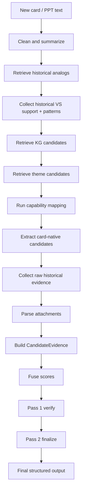
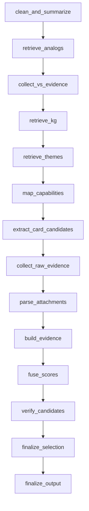
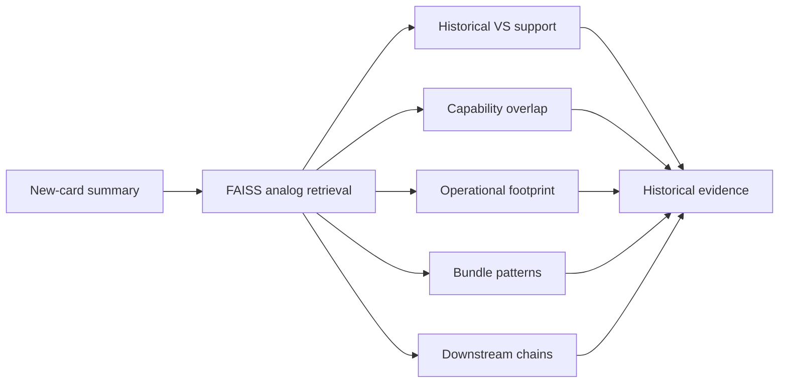
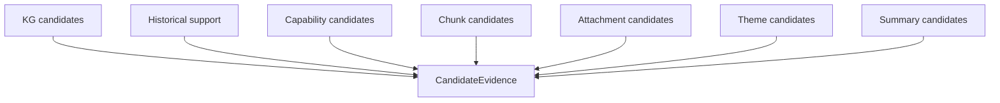

# `rag-summary` Architecture
## Complete detailed explanation of the current live repo architecture

## 1. Purpose

`rag-summary` is a graph-driven, evidence-fusion system for predicting healthcare value streams from a new idea card, PPT-like text, or related artifacts.

Its job is to take a new idea card or PPT-like input, retrieve and synthesize evidence from multiple sources, and produce a structured prediction of value streams in three classes:

- `directly_supported`
- `pattern_inferred`
- `no_evidence`

The current repo is no longer a simple summary-first RAG prototype. It is now a multi-stage evidence system with:

- structured new-card understanding
- historical analog retrieval
- KG candidate retrieval
- capability mapping
- theme retrieval
- attachment parsing
- candidate evidence assembly
- source-aware fusion
- two-pass verification/finalization

---

## 2. What problem the system solves

The system solves this problem:

> Given a new partially observed initiative, predict which value streams are directly supported by the current intake-time evidence, which value streams are only pattern-inferred from historical and thematic context, and which streams do not currently have enough evidence.

This framing matters because a new idea card is usually incomplete.

A new card may include:
- business intent
- top-level workflow changes
- some actor references
- some artifact text
- maybe some embedded tables or sections

But it often does not fully expose all downstream implementation streams.

So the system must combine:
- what the card explicitly says
- what card-local attachment structure suggests
- what similar historical tickets looked like
- what canonical value streams match semantically
- what capability clusters imply
- what theme clusters imply
- what historical bundles/downstream patterns repeatedly occur

That is why the architecture is multi-stage and evidence-centric.

---

## 3. High-level architecture



This is the current live runtime architecture.

---

## 4. Repository structure and ownership

```text
rag-summary/
├── pipeline.py
├── graph/
│   ├── build_prediction_graph.py
│   ├── nodes.py
│   └── edges.py
├── models/
├── ingestion/
├── retrieval/
├── generation/
├── chains/
├── config/
└── tools/
```

### Main ownership by area

#### `pipeline.py`
Public API wrapper and output shaping.

#### `graph/`
Real orchestration and conditional routing.

#### `models/`
State and structured contracts passed between nodes and chains.

#### `ingestion/`
Input shaping and memory preparation:
- summary generation
- function normalization
- FAISS index build
- adapters and protocols
- attachment parsing
- theme index/retrieval helpers

#### `retrieval/`
Evidence retrieval and historical analysis:
- historical analog retrieval
- KG retrieval
- raw evidence lookup
- historical VS support
- bundle patterns
- downstream chains

#### `generation/`
Candidate construction and scoring logic:
- capability mapping
- card-native candidates
- attachment-native candidates
- candidate evidence
- fusion

#### `chains/`
LLM chains:
- summary generation
- pass-1 verification
- pass-2 finalization

#### `config/`
Runtime configuration and indices:
- capability map
- theme index and related config

#### `tools/`
Offline utilities such as capability-map bootstrap.

---

## 5. Public entrypoint

## `pipeline.py`

`pipeline.py` is intentionally thin.

Its job is:
- call `run_prediction_graph(...)`
- optionally persist debug artifacts
- normalize the final public return shape

It is **not** where orchestration logic lives anymore.

### Public output shape

The wrapper returns fields like:
- `directly_supported`
- `pattern_inferred`
- `no_evidence`
- `selected_value_streams`
- `rejected_candidates`
- `new_card_summary`
- `analog_tickets`
- `historical_value_stream_support`
- `candidate_value_streams`
- `capability_mapping`
- `raw_evidence`
- `warnings`
- `timing`

### Why this design is good

This separation keeps:
- business logic in nodes
- runtime sequencing in the graph
- public API shape in one place

That makes the repo easier to evolve without breaking callers.

---

## 6. The graph is the real runtime

## `graph/build_prediction_graph.py`

This file defines the actual runtime execution graph.

It uses LangGraph when available and provides a sequential fallback when LangGraph is not installed.

### Current node sequence



### Conditional routing

`graph/edges.py` provides routing for:
- stopping early if the cleaned text is empty
- skipping VS evidence collection if no analogs are found
- skipping pass-2 finalization if pass-1 verification fails completely

This keeps the runtime robust while preserving the overall architecture.

---

## 7. Shared runtime state

## `models/graph_state.py`

The graph passes data between nodes using a `TypedDict` called `PredictionState`.

This is the central runtime state contract.

### Main state groups

#### Raw and cleaned input
- `raw_text`
- `cleaned_text`
- `allowed_value_stream_names`
- `top_k_analogs`

#### Structured new-card understanding
- `new_card_summary`

#### Historical analog retrieval
- `analog_tickets`
- `historical_value_stream_support`

#### KG and capability stages
- `kg_candidates`
- `capability_mapping`
- `enriched_candidates`

#### Theme and historical pattern stages
- `theme_candidates`
- `bundle_patterns`
- `downstream_chains`

#### Card-native and attachment stages
- `summary_candidates`
- `chunk_candidates`
- `card_attachment_candidates`
- `historical_footprint_candidates`
- `attachment_docs`
- `attachment_native_candidates`

#### Raw historical evidence
- `raw_evidence`
- `attachment_candidates`

#### Evidence and scoring
- `candidate_evidence`
- `fused_candidates`

#### LLM decision layers
- `verify_judgments`
- `selection_result`

#### Final outputs
- `directly_supported`
- `pattern_inferred`
- `no_evidence`
- `selected_value_streams`
- `rejected_candidates`

#### Diagnostics
- `errors`
- `warnings`
- `timing`

#### Private injected config keys
The graph also uses private runtime keys such as:
- `_index_dir`
- `_ticket_chunks_dir`
- `_top_kg_candidates`
- `_include_raw_evidence`
- `_max_raw_evidence_tickets`
- `_min_candidate_floor`
- `_llm`
- `_theme_svc`
- `_intake_date`

These are internal runtime controls, not part of the public API.

---

## 8. End-to-end runtime flow in plain English

Before diving into every node, here is the full flow in plain English.

1. Clean the input text and build a structured semantic summary.
2. Retrieve similar historical tickets from the FAISS summary index.
3. Convert those analogs into historical support and historical pattern signals.
4. Retrieve canonical KG candidates.
5. Retrieve theme-derived candidates when the environment supports it.
6. Apply capability mapping to recover implied or downstream streams.
7. Extract candidates directly from the card itself.
8. Retrieve raw snippets from shortlisted historical tickets.
9. Parse attachment-like content into structured sections.
10. Merge all candidate sources into unified evidence objects.
11. Rank those evidence objects with source-aware fusion.
12. Run pass-1 LLM verification.
13. Run pass-2 LLM finalization.
14. Return the final three-class output.

---

## 9. Node-by-node explanation

## 9.1 `clean_and_summarize`

### What it does
This is the first node in the graph.

It:
1. cleans the raw card text,
2. checks whether anything meaningful remains,
3. runs structured summary generation,
4. falls back to a deterministic keyword-based summary if LLM generation fails.

### Main inputs
- `raw_text`

### Main outputs
- `cleaned_text`
- `new_card_summary`
- optional `errors`
- optional `warnings`

### Why it exists
Everything downstream needs a cleaner, structured representation than raw text.

This node creates the semantic representation used by:
- FAISS analog retrieval
- KG retrieval
- capability mapping
- card-native candidate extraction

### Why fallback exists
Because the system should degrade gracefully if the summary chain fails.

---

## 9.2 `retrieve_analogs`

### What it does
This node queries the FAISS historical summary index.

It uses the new-card summary to retrieve top-k historical analog tickets.

### Main inputs
- `new_card_summary`
- `_index_dir`
- `top_k_analogs`

### Main outputs
- `analog_tickets`

### Why it exists
This is the historical memory entrypoint.

The system needs to know:
- what similar historical initiatives looked like
- what value streams they mapped to
- what capability and operational footprint they carried

This is the first step in bringing history into runtime reasoning.

---

## 9.3 `collect_vs_evidence`

### What it does
This node transforms the analog tickets into structured historical support.

It:
- aggregates value-stream support from analogs
- detects `bundle_patterns`
- detects `downstream_chains`

### Main inputs
- `analog_tickets`
- `_ticket_chunks_dir`
- `allowed_value_stream_names`

### Main outputs
- `historical_value_stream_support`
- `bundle_patterns`
- `downstream_chains`

### Why it exists
Retrieving analogs is not enough.

The system also needs to know:
- which streams repeatedly appeared in similar tickets
- which streams often co-occur
- which streams tend to appear downstream of others

This node converts analog retrieval into usable historical reasoning signals.

---

## 9.4 `retrieve_kg`

### What it does
This node retrieves canonical value-stream candidates from the KG/index layer.

It builds retrieval text from the structured summary and falls back to cleaned text if needed.

### Main inputs
- `new_card_summary`
- `cleaned_text`
- `_top_kg_candidates`
- `allowed_value_stream_names`

### Main outputs
- `kg_candidates`

### Why it exists
The historical layer tells you what happened in similar past initiatives.

The KG layer tells you what official/canonical value streams semantically match the current initiative.

This is the canonical grounding layer.

---

## 9.5 `retrieve_themes`

### What it does
This node retrieves theme-derived candidates.

It:
- builds a query from summary/cleaned text,
- uses an injected theme service if present,
- otherwise tries to auto-discover a local FAISS theme index,
- otherwise falls back safely to noop behavior.

### Main inputs
- `new_card_summary`
- `cleaned_text`
- `_theme_svc`
- `_intake_date`
- `allowed_value_stream_names`

### Main outputs
- `theme_candidates`

### Why it exists
Theme is a pattern-level evidence source.

It helps when value streams are implied by:
- recurring grouped work
- thematic clusters
- initiative patterns that are not explicit in direct text

### Important limitation
Theme is real, but environment-dependent:
- if a theme backend/index is available, it contributes
- otherwise the runtime degrades gracefully

---

## 9.6 `map_capabilities`

### What it does
This node applies capability mapping using the YAML capability map.

It checks:
- direct cues
- indirect cues
- canonical functions

Then it determines which capability clusters fire and which value streams should be promoted or enriched.

### Main inputs
- `new_card_summary`
- `cleaned_text`
- `historical_value_stream_support`
- `kg_candidates`
- `allowed_value_stream_names`

### Main outputs
- `capability_mapping`
- `enriched_candidates`

### Why it exists
Semantic retrieval alone misses many downstream or implied streams.

Capability mapping is the recall-repair layer.

It helps recover streams related to:
- onboarding
- billing/order-to-cash
- request handling
- compliance
- partner workflows
- analytics/reporting

---

## 9.7 `extract_card_candidates`

### What it does
This node extracts candidate signals directly from the new card and immediate context.

It builds:
- `summary_candidates`
- `chunk_candidates`
- `card_attachment_candidates`
- `historical_footprint_candidates`

### Main inputs
- `new_card_summary`
- `cleaned_text`
- `analog_tickets`
- `allowed_value_stream_names`

### Main outputs
- `summary_candidates`
- `chunk_candidates`
- `card_attachment_candidates`
- `historical_footprint_candidates`

### Why it exists
Without this node, the runtime would over-rely on:
- historical analogs
- KG retrieval
- capability mapping

This node ensures the new card itself remains a first-class evidence source.

---

## 9.8 `collect_raw_evidence`

### What it does
This node collects raw evidence snippets from top historical analog tickets.

It:
- selects top analog ticket IDs,
- builds a query,
- retrieves raw chunks/snippets from `ticket_chunks`,
- converts those into proxy attachment candidates.

### Main inputs
- `analog_tickets`
- `_ticket_chunks_dir`
- `_max_raw_evidence_tickets`
- `new_card_summary`
- `cleaned_text`

### Main outputs
- `raw_evidence`
- `attachment_candidates`

### Why it exists
Historical analog summaries are useful, but sometimes you need raw snippets.

This node adds:
- verifier context
- raw evidence traceability
- analog-proxy attachment evidence

---

## 9.9 `parse_attachments`

### What it does
This node parses attachment-like content into structured sections.

It supports two modes:

#### Mode 1 — explicit attachment contents
If `_attachment_contents` is provided, it parses those attachment texts.

#### Mode 2 — fallback from card body
If no explicit attachments are provided, it scans the cleaned card text for attachment-like sections.

It uses `AttachmentParser` and then generates:
- `attachment_docs`
- `attachment_native_candidates`

### Main inputs
- `cleaned_text`
- `_attachment_contents`
- `allowed_value_stream_names`

### Main outputs
- `attachment_docs`
- `attachment_native_candidates`

### Why it exists
Artifact structure often reveals evidence that summaries miss:
- budgets
- requirements
- scopes
- roadmaps
- tables
- appendices
- exhibits

This node turns attachment-like structure into first-class evidence.

### Important limitation
This parser is still **text-level**, not binary-native.
Real PDF/XLSX/DOCX/PPTX parsing still requires upstream extraction before entering this node.

---

## 9.10 `build_evidence`

### What it does
This is the core evidence-fusion node.

It takes all candidate sources and merges them into unified `CandidateEvidence` objects.

### Sources merged here
- KG candidates
- historical candidates
- capability candidates
- chunk candidates
- summary candidates
- theme candidates
- card attachment candidates
- attachment-native candidates
- analog-proxy attachment candidates
- historical footprint candidates

### Additional work done here
- enriches historical support before merge
- injects summary-source candidates
- injects bundle-pattern snippets
- injects downstream-chain snippets

### Main outputs
- `candidate_evidence`

### Why it exists
This is where the system becomes a true evidence system.

Before this node, there are many partial candidate lists.
After this node, there is one unified object per candidate containing:
- source scores
- evidence snippets
- support type
- source diversity
- placeholders for fused score/confidence

This is the architectural center of the runtime.

---

## 9.11 `fuse_scores`

### What it does
This node scores `CandidateEvidence` objects using source-aware fusion.

It:
- applies source weights
- adds diversity bonus
- applies zero-evidence penalties
- applies a candidate floor

### Main inputs
- `candidate_evidence`
- `_min_candidate_floor`

### Main outputs
- `fused_candidates`

### Why it exists
The runtime should not rely on raw source order or loose candidate lists.

This node turns evidence objects into ranked candidates with explicit scores.

---

## 9.12 `verify_candidates`

### What it does
This is Pass 1 of the LLM decision process.

It sends:
- the new-card summary
- analog tickets
- fused candidates
- raw evidence

into `SelectorVerifyChain`.

This produces:
- `verify_judgments`

### Main outputs
- `verify_judgments`

### Why it exists
This stage asks:
- is this candidate actually supported?
- what type of support does it have?
- is the evidence direct, pattern-like, mixed, or weak?

It is the per-candidate evidence check stage.

---

## 9.13 `finalize_selection`

### What it does
This is Pass 2 of the LLM decision process.

It takes:
- `verify_judgments`
- `fused_candidates`
- `new_card_summary`

and runs `SelectorFinalizeChain`.

This produces a `SelectionResult` containing:
- `directly_supported`
- `pattern_inferred`
- `no_evidence`

### Why it exists
Verification and final decision are not the same task.

Pass 1 checks candidates individually.  
Pass 2 makes the final structured decision.

That separation is a major strength of the current architecture.

---

## 9.14 `finalize_output`

### What it does
This node shapes the final public result.

It:
- rehydrates `selection_result` if needed
- falls back to verify judgments if final selection is empty
- deduplicates entity names
- builds compatibility `selected_value_streams`
- builds `rejected_candidates`

### Main outputs
- `directly_supported`
- `pattern_inferred`
- `no_evidence`
- `selected_value_streams`
- `rejected_candidates`

### Why it exists
The public API needs:
- stable output
- compatibility for older consumers
- clean final buckets
- deduplication
- graceful fallback if pass-2 failed

---

## 10. Historical memory architecture

The historical layer is one of the most important parts of the repo.

It is not just:
- “retrieve similar old tickets”

It is now closer to:
- “retrieve similar initiatives and extract their support patterns”

### Historical flow



This is why the historical store is so important.

---

## 11. CandidateEvidence as the center of the runtime

`CandidateEvidence` is the central runtime contract.

Everything important eventually flows into it.

### Conceptual structure



Each final candidate contains:
- who the candidate is
- which sources support it
- what snippets support it
- what support type it appears to have
- how diverse the support is
- what its final fused score is

This is why the architecture is now evidence-first.

---

## 12. Data stores and persistent assets

The repo uses several persistent or semi-persistent assets.

### A. FAISS summary index
Stores rich historical summary documents.

### B. Ticket chunks
Used for retrieving raw historical evidence snippets.

### C. Capability map YAML
Defines capability clusters and promoted streams.

### D. Theme index
Optional FAISS index for theme retrieval.

### E. Debug artifact directory
Optional output path for inspecting one pipeline run.

---

## 13. Debug artifacts

When debug output is enabled, the pipeline can persist runtime artifacts such as:

- `new_card_summary.json`
- `analog_tickets.json`
- `vs_support.json`
- `kg_candidates.json`
- `capability_mapping.json`
- `candidate_evidence.json`
- `fused_candidates.json`
- `raw_evidence.json`
- `selection_result.json`
- `bundle_patterns.json`
- `downstream_chains.json`
- `theme_candidates.json`
- `eval_log.json`

These are useful for debugging, architecture validation, and inspection of one run.

---

## 14. Current strengths

The strongest parts of the current repo are:

1. graph-based runtime orchestration is real
2. public pipeline wrapper is thin and correct
3. structured summary generation is strong
4. function normalization is solid
5. historical FAISS memory is rich
6. capability mapping is substantive
7. attachment parsing exists in runtime
8. candidate evidence is the true core object
9. fusion is explicit
10. pass-1/pass-2 decision flow is correct

---

## 15. Current limitations

The most important remaining limitations are:

### A. Theme is environment-dependent
Theme works when the environment provides a theme index or theme service.
It is not yet guaranteed active everywhere.

### B. Attachment parsing is still text-level
There is no native binary parsing inside the repo yet.

### C. Attachment-native candidate generation should be reviewed carefully
The implementation is real, but deserves immediate bug review.

### D. Historical footprint is not yet fully calibrated
It is being used, but not yet as a fully explicit score family.

### E. The adapter boundary is cleaner than before, but still not fully self-contained
Default factories still lazy-import internal services.

### F. Some comments/docstrings still lag behind the live runtime
The graph and nodes are more advanced than some wrapper-level descriptions.

---

## 16. Recommended immediate attention

The most concrete likely live issue is:

> **review and fix `generation/attachment_candidates.py` first**

That matters because:
- it is part of an important evidence source
- a bug there can silently weaken attachment-native evidence
- that can reduce direct-support quality

After that, the next strongest improvements are:
1. make theme activation more explicit and observable
2. add binary-native attachment ingestion
3. deepen historical-footprint calibration
4. reduce internal infra dependence
5. update docs/comments to match the live runtime

---

## 17. Final verdict

`rag-summary` is now:

> **a strong graph-based evidence system with real V6 features already implemented**

It is not a simple summary-RAG prototype anymore.

The architecture is real in code.

The remaining work is mainly about:
- increasing maturity
- improving production-readiness
- closing a few specific gaps

not about redesigning the core system.
