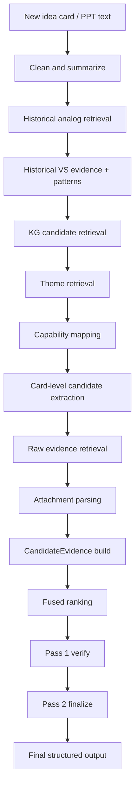
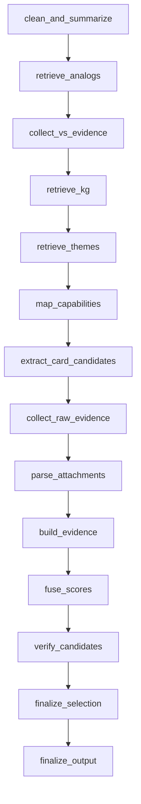
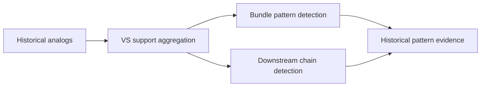

# `rag-summary` Architecture
## Current live architecture of the repo

## 1. Purpose

`rag-summary` is a graph-driven value-stream prediction system for healthcare idea cards and related artifacts.

Its job is to take a new idea card or PPT-like text, retrieve and synthesize evidence from multiple sources, and produce a structured prediction of value streams in three classes:

- `directly_supported`
- `pattern_inferred`
- `no_evidence`

The current repo is no longer a simple summary-first RAG prototype. It is now a multi-stage evidence system with:

- structured new-card understanding
- historical analog retrieval
- KG candidate retrieval
- capability mapping
- theme retrieval
- attachment parsing
- candidate evidence assembly
- source-aware fusion
- two-pass verification/finalization

---

## 2. High-level system view



---

## 3. Core design principles

The current system follows these principles:

1. **Evidence-first, not label-first**  
   The runtime is built around candidate evidence, not free-form stream guessing.

2. **Multiple sources, one merged candidate object**  
   All sources eventually flow into `CandidateEvidence`.

3. **Direct vs pattern must be separated**  
   The final output distinguishes directly supported signals from pattern-inferred signals.

4. **History should act as initiative-pattern memory**  
   Historical tickets are not just similar summaries; they also provide footprint and downstream evidence.

5. **Capability mapping repairs recall**  
   Semantic retrieval alone is not enough for downstream or implied streams.

6. **Graph orchestration is the source of truth**  
   The real runtime is defined in the graph layer, not in a monolithic imperative pipeline.

---

## 4. Repository structure

At a high level, the repo is organized into:

```text
rag-summary/
├── pipeline.py
├── graph/
│   ├── build_prediction_graph.py
│   ├── nodes.py
│   └── edges.py
├── models/
├── ingestion/
├── retrieval/
├── generation/
├── chains/
├── config/
└── tools/
```

### Main ownership by area

- `pipeline.py`  
  Public entrypoint and output shaping

- `graph/`  
  Orchestration and conditional routing

- `models/`  
  State and contract definitions

- `ingestion/`  
  Summary generation, normalization, index build, adapters, attachment parsing

- `retrieval/`  
  Historical analog lookup, KG lookup, raw evidence retrieval, pattern detection

- `generation/`  
  Capability mapping, candidate evidence build, fusion, attachment-native candidates, card candidates

- `chains/`  
  LLM verification and finalization chains

- `config/`  
  Capability map and related config

- `tools/`  
  Offline build/bootstrap utilities

---

## 5. Public entrypoint

## `pipeline.py`

`pipeline.py` is intentionally thin.

Its responsibilities are:

- call `run_prediction_graph(...)`
- optionally persist debug artifacts
- normalize the final public return shape

It is **not** the place where orchestration logic lives anymore.

### Public output shape

The wrapper returns:

- `directly_supported`
- `pattern_inferred`
- `no_evidence`
- `selected_value_streams` (compat union)
- `rejected_candidates`
- `new_card_summary`
- `analog_tickets`
- `historical_value_stream_support`
- `candidate_value_streams`
- `capability_mapping`
- `raw_evidence`
- `warnings`
- `timing`

---

## 6. Runtime orchestration

## `graph/build_prediction_graph.py`

The actual runtime flow is defined as a LangGraph state graph, with a sequential fallback when LangGraph is unavailable.

### Current node sequence



### Conditional routing

`graph/edges.py` provides routing logic for:

- stopping early if input text becomes empty after cleaning
- skipping VS evidence collection if no analogs are found
- skipping pass-2 finalization if pass-1 verification failed completely

This makes the graph robust while still preserving the same overall architecture.

---

## 7. Shared runtime state

## `models/graph_state.py`

The graph uses a `TypedDict` state object called `PredictionState`.

This state is the backbone of the whole runtime.

### Major state groups

#### Inputs
- `raw_text`
- `cleaned_text`
- `allowed_value_stream_names`
- `top_k_analogs`

#### New-card understanding
- `new_card_summary`

#### Historical retrieval
- `analog_tickets`
- `historical_value_stream_support`

#### KG and capability stages
- `kg_candidates`
- `capability_mapping`
- `enriched_candidates`

#### Theme and historical pattern stages
- `theme_candidates`
- `bundle_patterns`
- `downstream_chains`

#### Card/attachment stages
- `summary_candidates`
- `chunk_candidates`
- `card_attachment_candidates`
- `historical_footprint_candidates`
- `attachment_docs`
- `attachment_native_candidates`

#### Evidence + scoring
- `raw_evidence`
- `attachment_candidates`
- `candidate_evidence`
- `fused_candidates`

#### Verification/final output
- `verify_judgments`
- `selection_result`
- `directly_supported`
- `pattern_inferred`
- `no_evidence`
- `selected_value_streams`
- `rejected_candidates`

#### Diagnostics
- `errors`
- `warnings`
- `timing`

#### Internal/private injected config
- `_index_dir`
- `_ticket_chunks_dir`
- `_top_kg_candidates`
- `_include_raw_evidence`
- `_max_raw_evidence_tickets`
- `_min_candidate_floor`
- `_llm`
- `_theme_svc`
- `_intake_date`
- optional additional runtime-private values

---

## 8. New-card understanding layer

## `ingestion/summary_generator.py`

This is the structured semantic understanding layer.

It does not only summarize; it builds a structured document describing the new card.

### Summary fields produced

Typical fields include:

- `short_summary`
- `business_goal`
- `actors`
- `direct_functions_raw`
- `implied_functions_raw`
- `direct_functions_canonical`
- `implied_functions_canonical`
- `change_types`
- `domain_tags`
- `capability_tags`
- `operational_footprint`

This is the representation used by downstream retrieval and reasoning.

---

## 9. Function normalization layer

## `ingestion/function_normalizer.py`

The function normalization layer keeps downstream reasoning stable.

### Why it exists

Raw LLM output is too variable.  
For example:
- "vendor eligibility handoff"
- "partner setup"
- "provider onboarding"

may all need to normalize into more stable canonical functions.

### Current role

The normalizer:
- maintains a canonical vocabulary
- uses trigger-token rules
- deduplicates outputs
- maps raw direct/implied phrases to canonical categories

### Examples of canonical functions

- product setup
- outreach
- reporting
- vendor integration
- billing
- payment
- onboarding
- portal access
- request handling
- quote/rating
- care workflow
- compliance
- analytics
- eligibility
- claims processing
- enrollment
- authorization
- grievance/appeals
- pharmacy
- risk adjustment
- credentialing
- network management
- data migration
- system integration

---

## 10. Historical store

## `ingestion/faiss_indexer.py`

The historical FAISS store is one of the strongest parts of the repo.

It is no longer a plain summary index.  
It acts as a richer historical initiative memory.

### Historical document schema includes

- ticket metadata
- summary fields
- raw/canonical direct functions
- raw/canonical implied functions
- capability tags
- operational footprint
- mapped value streams
- stream support type
- supporting evidence

### Embedded retrieval text includes

- title
- summary
- business goal
- actors
- direct functions
- implied functions
- capability tags
- operational footprint
- mapped value streams

### Why this matters

This lets historical retrieval support:
- semantic analogy
- capability overlap
- footprint overlap
- downstream pattern memory

not just surface-level text similarity.

---

## 11. Retrieval layer

## `retrieval/summary_retriever.py` and related retrieval functions

The retrieval layer has several responsibilities.

### A. Historical analog retrieval
Find top historical summary documents from FAISS.

### B. Raw evidence retrieval
Pull raw chunks/snippets for shortlisted tickets.

### C. KG candidate retrieval
Retrieve canonical VS candidates from the KG/index layer.

### D. Historical support aggregation
Aggregate value-stream support from analog tickets.

### E. Historical pattern detection
Detect:
- `bundle_patterns`
- `downstream_chains`

These are key V6-leaning features.

### Historical pattern concept



This allows history to act as more than a label memory.

---

## 12. Theme retrieval

## `ingestion/adapters.py` + `ingestion/theme_retrieval_service.py` + `graph/nodes.py`

Theme retrieval is now a real runtime path.

### Current design

- `ThemeRetrievalService` is defined as a protocol in the adapter layer.
- Default fallback remains `_NoopThemeService`.
- `node_retrieve_themes` can auto-discover and instantiate a real `FaissThemeRetrievalService` if a theme FAISS index exists.
- Theme candidates then become a real source in `CandidateEvidence`.

### Theme role

Theme evidence is meant to be:
- a pattern-oriented source
- weaker than direct card evidence
- stronger than nothing when legitimate intake-time themes exist

### Important constraint

Theme is still environment-dependent:
- if theme index/service exists, it is active
- otherwise it gracefully degrades to noop behavior

---

## 13. Capability mapping

## `generation/capability_mapper.py` + `config/capability_map.yaml`

Capability mapping is one of the key recall-repair layers.

### Purpose

Semantic retrieval alone misses:
- downstream streams
- implied operational streams
- partner/onboarding streams
- billing/order-to-cash streams
- request-resolution streams

Capability mapping bridges business cues to likely value streams.

### Inputs

- new-card summary
- cleaned text
- historical VS support
- KG candidates
- allowed VS names

### Core logic

The capability mapper:
- loads clusters from `capability_map.yaml`
- checks direct cues
- checks indirect cues
- checks canonical functions
- applies weights and thresholds
- promotes streams
- emits capability candidates
- enriches KG candidates

### Capability map structure

The YAML includes clusters such as:
- compliance_privacy_audit
- enterprise_risk_governance
- vendor_partner_onboarding
- billing_order_to_cash
- enrollment_quoting
- product_launch_commercialization
- member_engagement_outreach
- care_management_clinical
- claims_adjudication
- portal_request_resolution
- analytics_reporting
- provider_network
- leads_opportunities

Each cluster typically has:
- description
- direct cues
- indirect cues
- canonical functions
- promoted streams
- related streams
- weight
- minimum signal threshold

---

## 14. Card-native candidate extraction

## `generation/card_candidates.py`

This layer generates candidates directly from the new card and its immediate local evidence.

### Current candidate sources produced

- `summary_candidates`
- `chunk_candidates`
- `card_attachment_candidates`
- `historical_footprint_candidates`

### Why this matters

Without this layer, the runtime would over-rely on:
- KG retrieval
- historical analogs
- capability mapping

This layer ensures the new card itself contributes meaningful candidate evidence.

---

## 15. Attachment parsing and attachment-native candidates

## `ingestion/attachment_parser.py` + `generation/attachment_candidates.py`

This is one of the most important newer additions.

### Current parser behavior

The parser is text-level. It does **not** parse binary files directly.  
It works on:
- already extracted attachment text
- or attachment-like structure inside cleaned card text

### Section types detected

- exhibit
- appendix
- table
- budget
- scope
- roadmap
- requirements
- heading
- body

### Current attachment-native candidate generation

`attachment_candidates.py` converts parsed sections into VS candidates using:
- capability-map cue scanning
- section-type-aware score ceilings
- content-signal extraction

Examples of special handling:
- budget sections → financial/billing/payment signals
- scope/requirements → action-verb based functional signals
- tables → multi-domain term signals

### Important current limitation

This is still text-driven and not binary-native.  
Real PDFs/XLSX/DOCX/PPTX still require upstream text extraction before entering the parser.

---

## 16. CandidateEvidence

## `generation/candidate_evidence.py`

`CandidateEvidence` is the central runtime artifact.

All candidate sources eventually flow here.

### Current sources merged

- KG
- historical
- capability
- chunk
- attachment
- summary
- theme

### Per-candidate fields include

- `candidate_id`
- `candidate_name`
- `source_scores`
- `evidence_sources`
- `evidence_snippets`
- `fused_score`
- `support_confidence`
- `source_diversity_count`
- `support_type`
- `contradictions`

### Support types

The runtime classifies candidates into support types such as:
- `direct`
- `pattern`
- `mixed`
- `none`

### Additional evidence injection

Historical bundle/downstream pattern snippets are injected during evidence build, so `CandidateEvidence` now carries more than plain source scores.

---

## 17. Fused scoring

## `generation/fusion.py`

The fusion layer applies source-aware ranking.

### Current behavior

- source-specific weights
- diversity bonus
- zero-evidence penalty
- candidate-floor guardrail

### Example default source weights

- chunk: 0.20
- summary: 0.15
- attachment: 0.18
- theme: 0.08
- kg: 0.18
- historical: 0.12
- capability: 0.09

### Why this matters

This means ranking is explicit and inspectable rather than being hidden in flow order.

---

## 18. Verification and finalization

## `chains/selector_verify_chain.py` + `chains/selector_finalize_chain.py` + graph nodes

The repo now uses a two-stage decision process.

### Pass 1 — verify
Per-candidate evidence verification

### Pass 2 — finalize
Finalize into:
- directly supported
- pattern inferred
- no evidence

### Why this is correct

This avoids a single flat “guess all streams” step and better matches the real problem:
- some streams are explicit/direct
- some streams are pattern-supported
- some streams are not actually justified

---

## 19. Offline tooling

## `tools/bootstrap_capability_map.py`

The repo includes offline tooling for capability-map bootstrap.

### Current role

- fetch or build VS corpus
- draft capability clusters
- generate coverage artifacts
- write `capability_map.yaml`

### Current maturity

Useful, but still more of a bootstrap path than a full evidence-enriched ontology pipeline.

---

## 20. External dependency boundary

## `ingestion/adapters.py`

The adapter layer is improved compared to earlier versions.

### Current protocols include

- `LLMService`
- `StructuredLLMService`
- `EmbeddingService`
- `KGRetrievalService`
- `ThemeRetrievalService`
- `SummaryIndexService`
- `RawEvidenceService`

### Current reality

This improves testability and design cleanliness, but the default factories still lazy-import internal services for:
- LLM generation
- embeddings
- KG retrieval

So the repo is cleaner than before, but still not fully self-contained.

---

## 21. Current strengths

The current strongest aspects of the repo are:

1. **Graph-based runtime orchestration**
2. **Rich historical FAISS store**
3. **Structured new-card understanding**
4. **Capability mapping**
5. **CandidateEvidence as the core runtime contract**
6. **Real attachment parsing path**
7. **Historical bundle/downstream pattern injection**
8. **Two-pass final decision structure**

---

## 22. Current weaknesses / limitations

The main remaining gaps are:

### A. Theme is still environment-dependent
Theme is real, but not guaranteed active in every runtime environment.

### B. Attachment parsing is still text-level
No binary-native parsing yet inside the repo.

### C. Attachment-native reasoning may still be fragile
The current implementation is real, but should be reviewed carefully. The current code suggests there may be a likely loop/indentation bug in `generation/attachment_candidates.py` that could affect correct candidate generation.

### D. Historical footprint is improved but not fully calibrated
It is being used, but not yet as a fully explicit multi-part score family.

### E. Internal infra coupling remains
The adapter layer is good, but default service factories still rely on internal imports.

### F. Some top-level docs/comments lag behind
The graph/runtime has moved ahead faster than some wrapper-level descriptions.

---

## 23. Recommended immediate attention

The most concrete likely live issue is:

> **review and fix `generation/attachment_candidates.py` first**

Why:
- it powers an important evidence source
- it appears to have a likely loop/indentation problem
- a bug there can silently weaken attachment-native evidence quality

After that, the next meaningful architectural improvements are:

1. make theme activation more explicit and observable
2. add binary-native attachment ingestion
3. deepen historical-footprint calibration
4. reduce dependency on internal infra
5. update docs/comments to match the live runtime

---

## 24. Final verdict

`rag-summary` is now:

> **a strong graph-based evidence system with real V6 features already implemented**

It is no longer best described as a refactored V5 prototype.

The architecture is now genuinely present in code.

The remaining work is about:
- strengthening maturity
- closing a few live gaps
- improving production-readiness

not about rethinking the core design.
